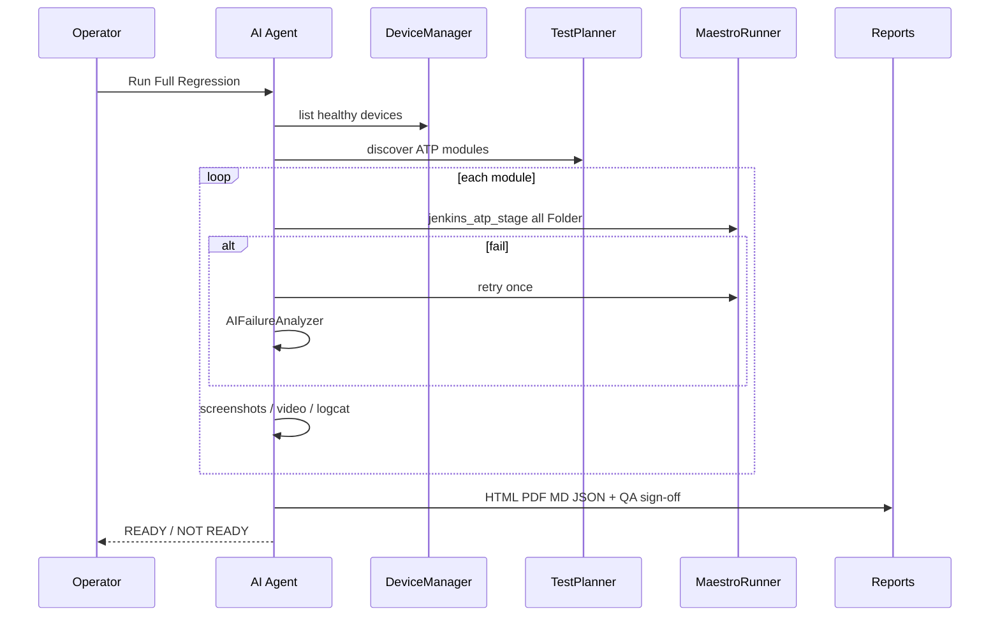

# Kodak Smile AI Agent — Architecture

## Overview

The AI Agent is an **orchestration layer** on top of the existing Kodak Smile Maestro ATP framework.

```
Operator / Jenkins
        │
        ▼
 ai-agent/main.py  (CLI)
        │
        ▼
 AgentOrchestrator
   ├── TestPlanner          → discovers ATP TestCase Flows/*
   ├── DeviceManager        → adb devices (healthy only)
   ├── ApkInstaller         → optional install -r
   ├── MaestroRunner        → scripts/jenkins_atp_stage.py (UNCHANGED YAML)
   ├── ScreenshotManager    → artifacts/screenshots
   ├── VideoRecorder        → artifacts/videos
   ├── LogcatCollector      → artifacts/logcat
   ├── CrashDetector        → FATAL/ANR/OOM/BT/printer
   ├── RetryManager         → retry failed module once
   ├── AIFailureAnalyzer    → rules + intelligent_platform
   ├── VisionProvider       → pluggable (null/openrouter/…)
   └── ReportGenerator      → HTML/PDF/MD/JSON + QA sign-off
```

## Project layout (requested)

| Requested | Implemented |
|-----------|-------------|
| `/ai-agent` | `ai-agent/` |
| `/vision` | `ai-agent/vision/` |
| `/reporting` | `ai-agent/reporting/` |
| `/log-analysis` | `ai-agent/log_analysis/` |
| `/device-manager` | `ai-agent/device_manager/` |
| `/utils` | `ai-agent/agent_utils/` (named to avoid clash with repo-root `utils/`) |
| `/docs` | `ai-agent/docs/` |


- Does **not** edit Maestro YAML under `ATP TestCase Flows/` or `flows/`
- Does **not** replace `build-summary/final_execution_report.xlsx`
- Does **not** require Jenkinsfile changes (optional stage already points at `ai-agent/main.py`)

## Sequence (full regression)



## Failure taxonomy

| Category | Meaning |
|----------|---------|
| automation_issue | Selector/timing/assert |
| application_bug | Crash/ANR/OOM/app defect |
| device_issue | Offline / flaky USB |
| environment_issue | Driver port, BT, printer lab |
| known_issue | Tracked wontfix |
| unknown_issue | Needs human triage |

## Vision extensibility

`VisionProvider` interface:

- `compare_images`
- `verify_expected_ui`
- `detect_visual_difference`

Providers: `null` (default), `openrouter` (optional), placeholders for Gemini / Vertex / Azure / Claude / Ollama via `AI_AGENT_VISION_PROVIDER`.
