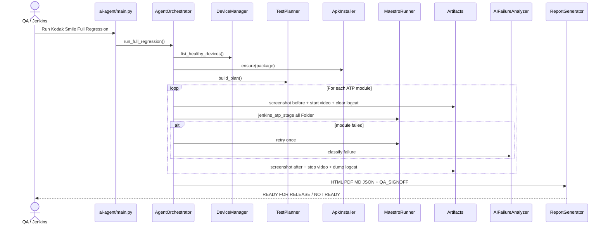

# Sequence diagram — Full regression

```mermaid
sequenceDiagram
    actor QA as QA / Jenkins
    participant CLI as ai-agent/main.py
    participant Orch as AgentOrchestrator
    participant Dev as DeviceManager
    participant Plan as TestPlanner
    participant APK as ApkInstaller
    participant Run as MaestroRunner
    participant Art as Artifacts
    participant AI as AIFailureAnalyzer
    participant Rep as ReportGenerator

    QA->>CLI: Run Kodak Smile Full Regression
    CLI->>Orch: run_full_regression()
    Orch->>Dev: list_healthy_devices()
    Orch->>APK: ensure(package)
    Orch->>Plan: build_plan()
    loop For each ATP module
        Orch->>Art: screenshot before + start video + clear logcat
        Orch->>Run: jenkins_atp_stage all Folder
        alt module failed
            Orch->>Run: retry once
            Orch->>AI: classify failure
        end
        Orch->>Art: screenshot after + stop video + dump logcat
    end
    Orch->>Rep: HTML PDF MD JSON + QA_SIGNOFF
    Rep-->>QA: READY FOR RELEASE / NOT READY
```

Maestro YAML is executed unchanged through the existing ATP stage entry point.
